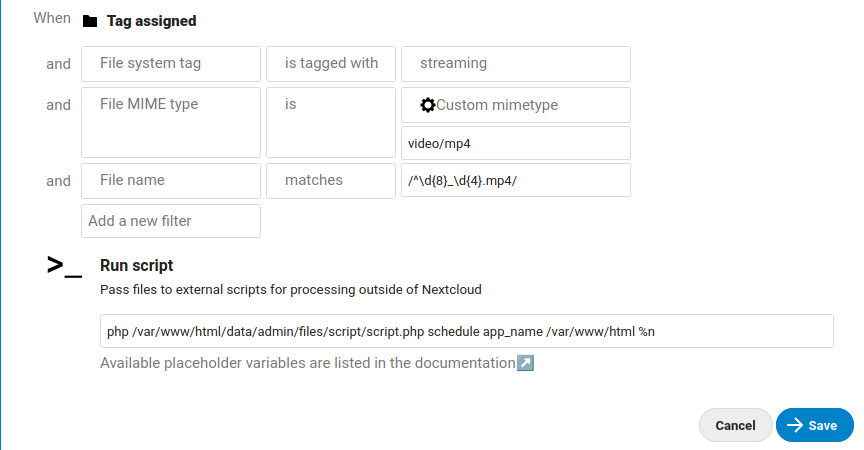

# Schedule video streaming using Nextcloud External Script

## Setup

* Clone this repository
* run `composer install` on root folder of this repository
* Copy the repository folder to files home of your Nextcloud account
* Setup Nextcloud External Script app
* Create a tag to use with a part of hook to run your script. I.E.: `streaming`. Suggestion: go to files and apply a tag to a file to create your tag and remove the tag, the tag will be saved on your database.
* Go to `Settings > Administration > Flow`
* Click on "`Add new flow`"
* Configure a Workflow with the follow settings:
  

### Structure of run script:

| param                   | description                                                                    |
| ----------------------- | ------------------------------------------------------------------------------ |
| php                     | binary of php on your sytem                                                    |
| /var/www/.../script.php | full path to `script.php` file                                                 |
| schedule                | event to run                                                                   |
| app_name                | A fake app name of your event. Used to storage the script on `appconfig` table |
| /var/www/html           | root folder of Nextcloud setup                                                 |
| %n                      | workflow script placeholder to nextcloud-relative path                         |

#### Available events:
* **schedule**: get the filename and schedule an event following the pattern of filename. The filename needs to follow this pattern: YYYYmmdd_HHii
* **run**: Run the scheduled streaming. This is a internal event, don't use with a parameter of run script.